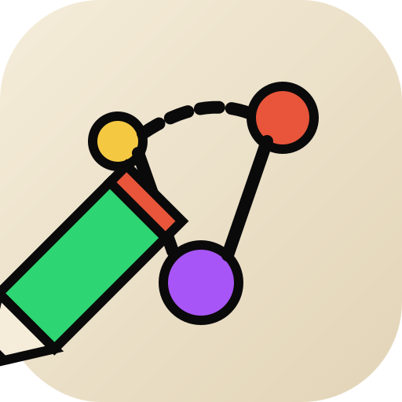
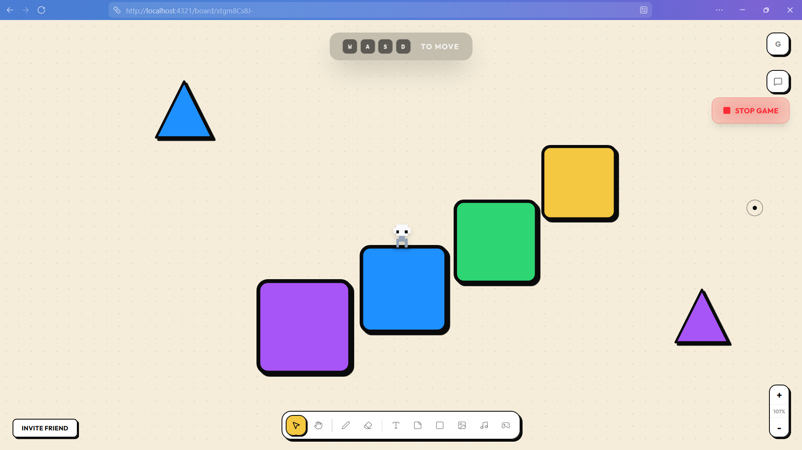

<div align="center">
  
  
  # PeerDraw
  
  ### ✨ Ephemeral, Serverless, P2P Collaboration Space ✨
  
  <p align="center">
    A real-time collaborative whiteboard with gesture controls, multiplayer cursors, and zero server infrastructure.
  </p>

  

  [](https://peerdraw.vercel.app)
  [](https://astro.build)
  [](https://react.dev)
  [](https://www.typescriptlang.org/)
  [](https://tailwindcss.com)

  [🚀 Live Demo](https://peerdraw.vercel.app) · [🔗 Project Link](https://peerdraw.vercel.app/)

</div>

---

## 🎯 What is PeerDraw?

**PeerDraw** is a cutting-edge, peer-to-peer collaborative workspace that operates entirely in your browser—no servers, no databases, no backend infrastructure. Create ephemeral collaboration spaces for brainstorming, whiteboarding, or just hanging out with your team in real-time.

### 🌟 Key Highlights

- **🔒 100% Private**: True P2P connection via WebRTC—your data never touches a server
- **⚡ Instant Setup**: Create a room in seconds, no sign-up required
- **🎨 Rich Content**: Text, images, sticky notes, drawings, and more
- **👋 Hand Gesture Controls**: AI-powered MediaPipe integration for hands-free interaction
- **🎮 Multiplayer Character**: Navigate the space with avatar controls
- **👁️ Live Cursors**: See exactly where everyone is pointing in real-time
- **🔐 Optional Passwords**: Secure your rooms with password protection
- **💾 Local Persistence**: Your recent rooms are saved locally via IndexedDB
- **📱 Responsive Design**: Works seamlessly on desktop and mobile

---

## 🖼️ Features

### 🎨 Collaborative Canvas
- Drag-and-drop elements anywhere on an infinite canvas
- Real-time synchronization between all participants
- Support for text, images, sticky notes, and drawings

### 🤝 Peer-to-Peer Magic
Powered by [Trystero](https://github.com/dmotz/trystero), PeerDraw establishes direct WebRTC connections between peers:
- Zero server costs
- Ultra-low latency
- Complete privacy
- Works behind most firewalls

### 👋 Gesture Recognition
Using [MediaPipe](https://developers.google.com/mediapipe) AI vision models:
- Control elements with hand gestures
- Pinch to grab and drag
- Wave to interact
- Completely hands-free experience

### 🎮 Character System
- Spawn a customizable avatar
- Move around the canvas with WASD or arrow keys
- See other players' characters in real-time
- Perfect for virtual hangouts

### 🎯 Modern UI/UX
- Glassmorphic design with smooth animations
- Dark mode optimized
- Framer Motion animations
- Radix UI components for accessibility
- Responsive across all devices

---

## 🛠️ Tech Stack

### Frontend Framework
- **[Astro](https://astro.build)** - Ultra-fast static site generator with partial hydration
- **[React 19](https://react.dev)** - Interactive UI components
- **[TypeScript](https://www.typescriptlang.org/)** - Type-safe development

### Styling & UI
- **[Tailwind CSS 4](https://tailwindcss.com)** - Utility-first CSS framework
- **[Radix UI](https://www.radix-ui.com/)** - Accessible component primitives
- **[Framer Motion](https://www.framer.com/motion/)** - Production-ready animations
- **[Lucide React](https://lucide.dev)** - Beautiful icon system

### P2P & Real-time
- **[Trystero](https://github.com/dmotz/trystero)** - Serverless WebRTC connections
- **[MediaPipe](https://developers.google.com/mediapipe)** - AI gesture recognition

### State Management & Storage
- **[Zustand](https://zustand-demo.pmnd.rs/)** - Lightweight state management
- **[Dexie.js](https://dexie.org/)** - IndexedDB wrapper for persistence
- **[idb-keyval](https://github.com/jakearchibald/idb-keyval)** - Simple key-value storage

### Developer Experience
- **[Bun](https://bun.sh)** - Fast JavaScript runtime & package manager
- **[Vercel](https://vercel.com)** - Deployment and hosting
- **[@vercel/analytics](https://vercel.com/analytics)** - Web analytics
- **[Canvas Confetti](https://www.kirilv.com/canvas-confetti/)** - Celebration effects

---

## 🚀 Getting Started

### Prerequisites

You need **[Bun](https://bun.sh)** installed on your machine:

```bash
# macOS/Linux
curl -fsSL https://bun.sh/install | bash

# Windows
powershell -c "irm bun.sh/install.ps1 | iex"
```

### Installation

1. **Clone the repository**
   ```bash
   git clone https://github.com/yourusername/peerdraw.git
   cd peerdraw
   ```

2. **Install dependencies**
   ```bash
   bun install
   ```

3. **Start the development server**
   ```bash
   bun dev
   ```

4. **Open your browser**
   ```
   http://localhost:4321
   ```

### Production Build

```bash
# Build for production
bun run build

# Preview production build locally
bun run preview
```

---

## 📖 Usage

### Creating a Room

1. Visit [peerdraw.vercel.app](https://peerdraw.vercel.app)
2. Optionally set a password for privacy
3. Click **"Create New Space"**
4. Share the generated room URL with collaborators

### Joining a Room

1. Get the Room ID from a collaborator
2. Enter it in the "Join existing" field
3. If password-protected, enter the password
4. Click the join button →

### Keyboard Shortcuts

| Action | Shortcut |
|--------|----------|
| Delete selected element | `Delete` / `Backspace` |
| Move character | `WASD` / `Arrow Keys` |
| Toggle gesture mode | Click gesture button |
| Add new element | Click `+` button |

### Gesture Controls

When enabled, use your webcam:
- **Open hand**: Show your hand to activate
- **Pinch**: Grab and drag elements
- **Closed fist**: Release element
- **Wave**: Navigate or interact

---

## 🏗️ Project Structure

```
peerdraw/
├── public/              # Static assets
│   ├── logo.svg        # PeerDraw logo
│   ├── favicon.svg     # Favicon
│   └── pixel_pet.png   # Character sprite
├── src/
│   ├── components/     # React components
│   │   ├── board/      # Board-specific components
│   │   │   ├── Toolbar.tsx
│   │   │   ├── DraggableElement.tsx
│   │   │   ├── Cursors.tsx
│   │   │   ├── Character.tsx
│   │   │   └── ...
│   │   ├── ui/         # Reusable UI components (Radix)
│   │   ├── Board.tsx   # Main board component
│   │   └── GestureController.tsx
│   ├── layouts/        # Astro layouts
│   ├── lib/            # Utilities and logic
│   │   ├── store.ts    # Zustand state management
│   │   ├── p2p.ts      # Trystero P2P logic
│   │   └── utils.ts    # Helper functions
│   ├── pages/          # Astro pages (routes)
│   │   ├── index.astro # Landing page
│   │   └── board/      # Dynamic board routes
│   └── styles/         # Global styles
├── astro.config.mjs    # Astro configuration
├── tailwind.config.js  # Tailwind configuration
├── tsconfig.json       # TypeScript configuration
└── package.json        # Dependencies
```

---

## 🎨 Customization

### Modify Theme Colors

Edit your Tailwind config or CSS variables in `src/styles/global.css`:

```css
:root {
  --primary: /* your color */;
  --background: /* your color */;
  --foreground: /* your color */;
}
```

### Add New Element Types

1. Update the `ElementType` union in `src/lib/store.ts`
2. Add rendering logic in `src/components/board/DraggableElement.tsx`
3. Update the toolbar in `src/components/board/Toolbar.tsx`

---

## 🤝 Contributing

Contributions are what make the open-source community amazing! Any contributions you make are **greatly appreciated**.

1. Fork the Project
2. Create your Feature Branch (`git checkout -b feature/AmazingFeature`)
3. Commit your Changes (`git commit -m 'Add some AmazingFeature'`)
4. Push to the Branch (`git push origin feature/AmazingFeature`)
5. Open a Pull Request

---

## 📝 License

This project is open source and available under the [MIT License](LICENSE).

---

## 💖 Support

If you find PeerDraw useful, consider supporting its development:

<a href="https://buymeacoffee.com/Rover01" target="_blank">
  
</a>

---

## 🙏 Acknowledgments

- [Astro](https://astro.build) for the incredible framework
- [Trystero](https://github.com/dmotz/trystero) for making P2P simple
- [MediaPipe](https://developers.google.com/mediapipe) for AI-powered gesture recognition
- [Radix UI](https://www.radix-ui.com/) for accessible components
- [Vercel](https://vercel.com) for seamless deployment

---

## 📬 Contact

Have questions or suggestions? Feel free to open an issue or reach out!

- **Live Demo**: [peerdraw.vercel.app](https://peerdraw.vercel.app)
- **Report Issues**: [GitHub Issues](../../issues)

---

<div align="center">
  
  **[⬆ back to top](#peerdraw)**
  
  Made with ❤️ and ☕
  
  <sub>If you like this project, don't forget to give it a ⭐!</sub>

</div>